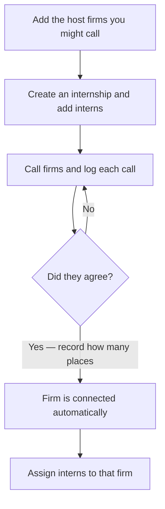

Minto is built around four records. Almost everything you'll do is creating one
of them or connecting them to each other. Understanding how they relate makes
the rest of these guides much easier to follow.

## The four records

<Columns cols={2}>
  <Card title="Intern" icon="user">
    A student going abroad on a work placement. Interns come from a sending
    organization.
  </Card>
  <Card title="Host firm" icon="building-2">
    A company that takes interns. You add these yourself and reuse them across
    many internships.
  </Card>
  <Card title="Sending organization" icon="school">
    The school or agency abroad that sends you students. Linked to you by a
    connection code.
  </Card>
  <Card title="Internship" icon="graduation-cap">
    One group of interns, travelling for one period, placed at host firms. This
    is the unit of work you plan and track.
  </Card>
</Columns>

## How they connect

An internship is where the other three meet. It usually has a sending
organization, a group of interns, and a host firm for each of them.

Two consequences worth knowing early:

- **Interns aren't created on their own.** You add them inside an internship,
  not from the Interns page. The Interns page is for finding and reviewing
  interns you already have.
- **Host firms are reusable.** Add a firm once and it stays in your list for
  every future internship. The same is true of sending organizations.

## How a placement actually happens

The order surprises people who expect to pick a firm from a list. You don't
choose where an intern goes — you ask companies until one says yes.

The step people miss is the third one. **Recording how many places a firm agreed
to is what connects it to the internship** — it isn't just note-keeping. Skip it
and the firm never becomes available to assign interns to, however positive the
call was.

Connecting a firm by hand is possible, and it's the right thing for an
arrangement made outside Minto. But for active recruitment, the call is the
route.

## Placement is the core job

Adding an intern to an internship puts them on the roster. It doesn't place
them anywhere yet — they still need a host firm that has agreed to take them.

The internships list makes this distinction visible. Both columns count against
the **planned** number of interns, not the roster:

- **Approved** — places host firms have agreed to take, from your recruitment
  calls.
- **Assigned** — interns actually given a firm.

So `1/3` under **Assigned** means one of three planned places filled. Approved
running ahead of Assigned is the normal state: firms have said yes, and you
haven't allocated the students yet.

<Frame caption="The internships list. Assigned shows placement progress — 3/3 is fully placed, 0/4 has nobody placed yet.">
  
</Frame>

## Fields of expertise

Internships and host firms both carry fields of expertise — Hospitality &
Tourism, IT & Software, Engineering, and so on.

Matching is **internship against firm**, not intern against firm: when you're
looking for somewhere to place a group, Minto recommends firms whose fields
overlap the internship's. You choose the internship's when you create it.

## Where to go next

<Columns cols={2}>
  <Card title="Add a host firm" icon="building-2" href="/how-to/add-a-host-firm">
    Build up the list of companies that can take your interns.
  </Card>
  <Card title="Create an internship" icon="graduation-cap" href="/how-to/create-an-internship">
    Set up a travel period and start adding interns.
  </Card>
</Columns>
